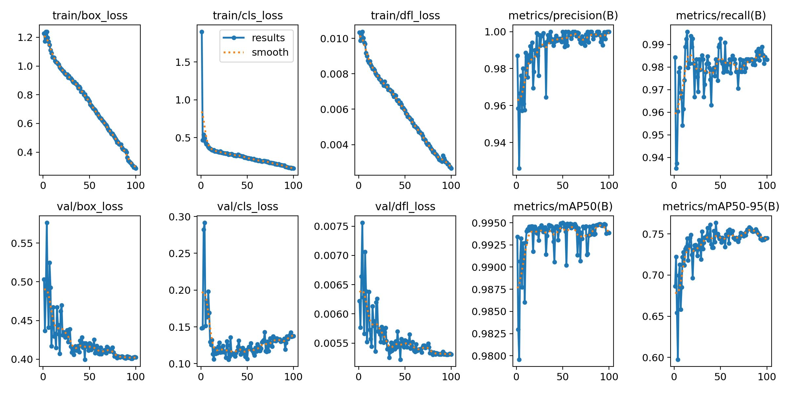
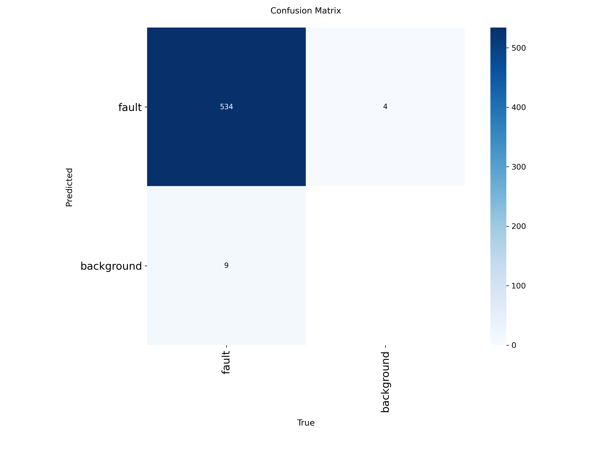
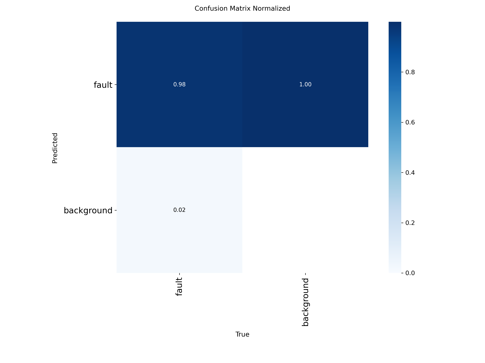
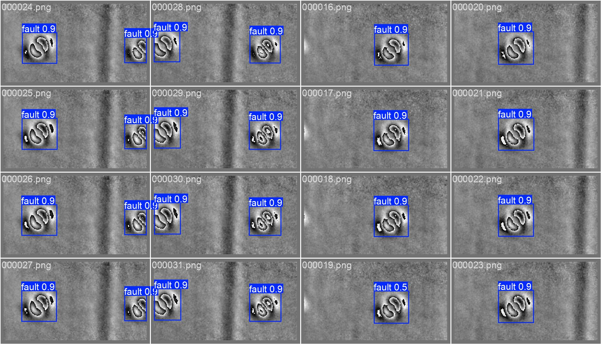

# Defect Detection in Shearography Images with AI

Language / Langue: English | [Français](README.md)

## Project overview
This repository contains a proof-of-concept AI pipeline for defect detection in shearography images using Ultralytics YOLO and the SADD dataset. The project focuses on detecting and localizing defective regions, and includes both training assets and a local Streamlit application for inference.

The work follows a two-stage approach:
- Level 1: binary detection trained only on faulty images
- Level 2: binary detection with additional healthy negative images (`good_clean` and `good_stripes`) to reduce false positives

## Problem statement
Manual inspection of shearography images can be time-consuming and subjective, especially when healthy deformation patterns visually resemble real defects. The goal of this project is to build a practical AI assistant that:
- detects the presence of a defect
- localizes suspicious regions with bounding boxes
- helps reduce false positives on healthy but visually challenging samples
- can be demonstrated through a lightweight local application

## Dataset
This project is based on the SADD dataset (Shearographic Anomaly Detection Dataset).

Relevant categories used in this repository:
- `faulty`: defective samples with annotated defect regions
- `good_clean`: healthy samples without defect annotations
- `good_stripes`: healthy samples with stripe-like deformation patterns that can confuse the detector

YOLO configuration used in this repository:
- single detection class: `fault`
- `SD_YOLO/`: Level 1 dataset
- `SD_YOLO_L2/`: Level 2 dataset with healthy negatives added as empty-label images

In this formulation:
- `good_clean` and `good_stripes` are not separate detection classes
- they are negative images used to improve robustness and false-positive behavior

## Methodology
The project uses Ultralytics YOLO for object detection.

High-level workflow:
1. Prepare a Level 1 dataset using only faulty images
2. Train and validate a binary detector for the `fault` class
3. Export the trained model to ONNX for deployment-oriented inference
4. Build a Level 2 dataset by mixing:
   - faulty images with labels
   - healthy `good_clean` images with empty labels
   - healthy `good_stripes` images with empty labels
5. Retrain and compare Level 2 against Level 1
6. Use the exported ONNX model in a local Streamlit demo application

Evaluation priorities:
- primary metric: `mAP50-95`
- complementary metrics: precision and recall

## Results
The `results/` folder contains the main training and validation artifacts currently tracked in the project, including:
- `results.csv`: training and validation metrics by epoch
- `results.png`: training summary curves
- `confusion_matrix.png`
- `confusion_matrix_normalized.png`
- `val_batch2_pred.jpg`: example prediction on the validation set

#### Training curves


#### Confusion matrix


#### Normalized confusion matrix


#### Validation prediction example


## Inference / deployment
This repository includes a local Streamlit application:
- `app.py`

The application:
- loads the ONNX model
- supports built-in images and custom uploads
- displays annotated predictions
- uses dark mode by default
- includes built-in examples for:
  - `fault`
  - `good_clean`
  - `good_stripes`

Simplified explanation shown in the application:
- Fault: real defect
- Good clean: healthy image
- Good stripes: healthy image with deformation patterns

## Repository structure
Simplified repository overview:

```text
shearography_ai/
├── README.md
├── README.fr.md
├── app.py
├── pyproject.toml
├── .streamlit/
│   └── config.toml
├── notebook/
│   └── shearo_model.ipynb
├── results/
│   ├── results.csv
│   ├── results.png
│   ├── confusion_matrix.png
│   ├── confusion_matrix_normalized.png
│   └── val_batch2_pred.jpg
├── SD_YOLO/
│   └── data.yaml
├── SD_YOLO_L2/
│   └── data.yaml
├── detect_L2/
│   └── train/weights/
│       ├── best.pt
│       └── best.onnx
└── app_assets/
    ├── sample_index.json
    └── sample_inputs/
```

## How to use
### 1. Create and activate a virtual environment
Example:

```bash
cd shearography_ai
python -m venv .venv
source .venv/bin/activate
```

### 2. Install dependencies
```bash
pip install -U pip
pip install -e .
```

If needed, install the project dependencies directly:
```bash
pip install ultralytics streamlit onnx onnxruntime pandas
```

### 3. Run the Streamlit app
```bash
streamlit run app.py
```

### 4. Run a prediction with Ultralytics

#### Prediction on a single image with the ONNX model
```bash
yolo predict task=detect model=detect_L2/train/weights/best.onnx source=app_assets/sample_inputs/fault_001.png imgsz=640 conf=0.25 save=True
```

#### Prediction on an image folder with the ONNX model
```bash
yolo predict task=detect model=detect_L2/train/weights/best.onnx source=app_assets/sample_inputs imgsz=640 conf=0.25 save=True
```

Notes:
- built-in examples are managed through `app_assets/sample_index.json`
- Ultralytics prediction outputs are usually saved in a `runs/detect/predict*` folder

## References
- SADD — Shearographic Anomaly Detection Dataset: [https://github.com/jessicaplassmann/SADD](https://github.com/jessicaplassmann/SADD)
- Ultralytics YOLO: [https://docs.ultralytics.com/](https://docs.ultralytics.com/)
- Automated Annotation of Shearographic Measurements Enabling Weakly Supervised Defect Detection: [https://arxiv.org/abs/2512.06171](https://arxiv.org/abs/2512.06171)
